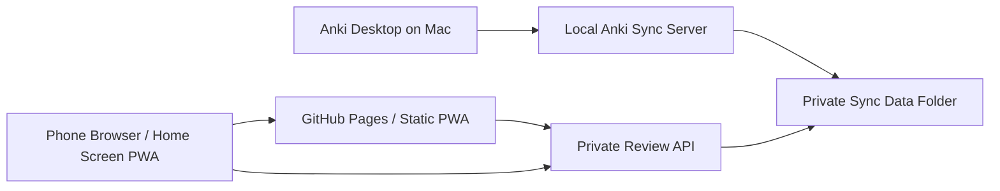

# Private Anki Server + Phone Web Frontend Plan

## Goal

Run Anki on this Mac with a private self-hosted data store, simple start/stop shortcuts, and a phone-friendly web app that can review cards without relying on the paid iOS AnkiMobile app.

## Design Principles

- Keep the official Anki desktop app as the canonical editor and data source.
- Use Anki's official self-hosted sync server for collection/media storage instead of inventing a sync protocol.
- Build a separate private API for the phone web frontend; do not expose Anki's raw sync server directly to the internet.
- Reuse Anki's open-source code/libraries where appropriate, and comply with its AGPL/BSD licensing if code is copied or published.
- Prefer private network access through Tailscale or a local LAN before public exposure.
- Make the phone frontend installable as a Progressive Web App.

## System Architecture

## Components

### 1. Anki Desktop

- Install with Homebrew:
  - `brew install --cask anki`
- Use desktop Anki for deck creation, imports, note types, templates, media management, database checks, and heavy editing.

### 2. Self-Hosted Sync Server

- Run the sync server bundled with Anki.
- Store server-side data in a dedicated folder such as:
  - `/Users/christopherwang/Documents/Anki/data/syncserver`
- Do not reuse the normal Anki profile folder as the server storage folder.
- Suggested environment:
  - `SYNC_USER1=<username>:<password>`
  - `SYNC_BASE=/Users/christopherwang/Documents/Anki/data/syncserver`
  - `SYNC_HOST=127.0.0.1` for local-only testing
  - `SYNC_HOST=0.0.0.0` only when using LAN/VPN access intentionally
  - `SYNC_PORT=8080`

### 3. Start/Stop Shortcuts

Create three layers:

- Shell scripts:
  - `scripts/start-anki-sync.sh`
  - `scripts/stop-anki-sync.sh`
  - `scripts/status-anki-sync.sh`
- macOS LaunchAgent:
  - `~/Library/LaunchAgents/local.anki-sync-server.plist`
- User shortcuts:
  - macOS Shortcuts app shortcuts named `Start Anki Server` and `Stop Anki Server`
  - Optional clickable `.command` files in the project folder

### 4. Private Review API

The sync server is for Anki clients, not a friendly web app API. Build a small local API that exposes only the operations the phone frontend needs.

Recommended stack:

- Backend: FastAPI or Rust Axum
- Data access: Anki's Python/Rust library APIs where possible
- Avoid direct SQLite mutation unless we first prove the official library path is insufficient

Initial endpoints:

- `GET /health`
- `GET /decks`
- `GET /review/next?deck_id=...`
- `POST /review/:card_id/answer`
- `GET /media/:filename`
- `POST /sync/pull`
- `POST /sync/push`

### 5. Phone Frontend

Host the static frontend on GitHub Pages.

Recommended stack:

- Vite + React or Svelte
- Mobile-first PWA
- Service worker for app-shell caching
- No bundled deck data in the public GitHub Pages build
- Configuration screen for private API URL
- Authentication token stored locally on the phone

Core views:

- Deck list
- Review queue
- Card front/back
- Answer buttons
- Basic stats
- Offline/error state
- Settings

### 6. Network Access

Recommended private setup:

- Use Tailscale on the Mac and phone.
- Bind the sync server/API to the Tailscale interface or localhost behind a reverse proxy.
- Use HTTPS for browser access if the phone PWA calls the API from GitHub Pages.

Avoid:

- Opening the plain Anki sync server directly to the public internet.
- Putting API passwords or deck content into the GitHub Pages repo.

### 7. Backups

Back up both:

- Normal Anki desktop profile data
- Self-hosted sync server data folder

Suggested backup targets:

- Local timestamped backups under `/Users/christopherwang/Documents/Anki/backups`
- Optional encrypted offsite backup later

Minimum backup commands:

- Stop services
- Archive sync folder
- Archive app config
- Restart services

## Development Phases

### Phase 0: Project Setup

- [x] Confirm Homebrew is installed.
- [x] Install Anki with Homebrew.
- [x] Create project directories: `scripts`, `data`, `server`, `frontend`, `docs`.
- [x] Create `.gitignore` that excludes data, secrets, databases, media, and backups.
- [x] Create `.env.example` without real passwords.

### Phase 1: Local Sync Server

- [x] Create sync data directory.
- [x] Create start script.
- [x] Create stop script.
- [x] Create status script.
- [x] Verify sync server starts locally.
- [x] Configure Anki Desktop to point at the local sync server.
- [x] Perform first desktop sync into the private server.
- [x] Document recovery steps.

### Phase 2: Shortcuts

- [x] Create LaunchAgent plist.
- [x] Test `launchctl` start/stop.
- [x] Create clickable `.command` wrappers.
- [ ] Create macOS Shortcuts entries.
- [x] Add status notification output.

### Phase 3: Backup System

- [x] Write backup script.
- [x] Write restore dry-run script.
- [x] Test a backup archive.
- [x] Add backup before destructive operations.
- [ ] Optional: schedule daily backups with LaunchAgent.

## Current Runtime Status

- LaunchAgent runtime: `/Users/christopherwang/Library/Application Support/AnkiPrivateServer`
- Sync endpoint: `http://127.0.0.1:8080`
- Active sync data: `/Users/christopherwang/Library/Application Support/AnkiPrivateServer/data/syncserver`
- First verified desktop sync: `2026-06-12 02:52 Asia/Taipei`
- Latest post-sync backup: `/Users/christopherwang/Library/Application Support/AnkiPrivateServer/backups/anki-private-server-20260612-025410.tar.gz`
- GitHub repository: `https://github.com/ChristopherTheSlash/Anki`
- GitHub Pages app: `https://christophertheslash.github.io/Anki/`
- Latest verified Pages deploy: `2026-06-12 03:16 Asia/Taipei`

### Phase 4: API Prototype

- [x] Choose FastAPI or Rust Axum.
- [x] Load an isolated working collection copy.
- [x] List decks.
- [x] Fetch next due card.
- [x] Render front/back safely.
- [x] Submit answer and update scheduling.
- [x] Serve media.
- [x] Add token authentication.
- [ ] Add API tests around scheduling behavior.

### Phase 5: Phone PWA

- [x] Scaffold frontend.
- [x] Build deck list.
- [x] Build review screen.
- [x] Build answer flow.
- [x] Add settings for API URL/token.
- [x] Add installable PWA manifest.
- [x] Add service worker.
- [x] Test on desktop browser.
- [ ] Test on phone browser over private network.

### Phase 6: GitHub Pages

- [x] Create GitHub repository.
- [x] Add frontend deploy workflow.
- [x] Ensure no private data is committed.
- [x] Configure GitHub Pages.
- [x] Verify the hosted app loads from GitHub Pages.
- [ ] Verify the hosted app loads on phone.
- [ ] Verify it can reach the private API over HTTPS/VPN.

### Phase 7: Hardening

- [ ] Add HTTPS reverse proxy if not using Tailscale HTTPS.
- [ ] Add rate limiting.
- [ ] Add CORS allowlist for the GitHub Pages domain.
- [ ] Add structured logs.
- [ ] Add health checks.
- [ ] Add version pinning for Anki/server compatibility.
- [ ] Add upgrade checklist.

## Open Decisions

- Backend stack: FastAPI is fastest to build; Rust Axum may align more naturally with Anki's Rust internals.
- Access model: Tailscale-only is simplest and safest; public domain plus reverse proxy is more convenient but riskier.
- Scope of phone editing: review-only first; note/deck editing later.
- Offline support: start with online-only review; offline review is much harder because scheduling conflicts must be merged correctly.

## First Build Milestone

The first complete milestone is:

- Homebrew Anki installed.
- Local sync server starts/stops from shortcuts.
- Data stored in the dedicated sync folder.
- Desktop Anki can sync to the private server.
- Backups work.

Only after that should the custom phone frontend begin.
